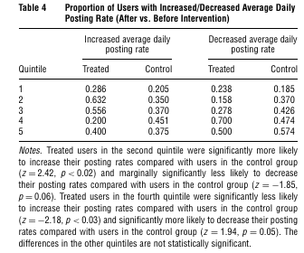

class: font200

# Learning Goals for this Week

* Explain what the definition of a "lurker"
* Analyse the marketing value of lurkers

---
class: inverse, center, middle

# Social Media Landscape

---
# Slide Title 

course content here

---
class: inverse, center, middle

# Why People Use Social Media Sites?

---
# Aspects of Use

1. Why people want to contribute to social media
  * Intrinsic vs. Image Related Utility 
  * [Toubia & Stephan, 2013][stephan-toubia]
2. How attention is allocated over content
  * [Filippas & Horton, 2021][filippas-horton]

[filippas-horton]: https://arxiv.org/abs/2104.00834
[stephan-toubia]: https://www.researchgate.net/publication/261851427_Intrinsic_vs_Image-Related_Utility_in_Social_Media_Why_Do_People_Contribute_Content_to_Twitter

---
# Intrinsic vs Image Related Utility

Why does a user want an audience?

1. **Intrinsic Utility**: inherent satisfaction 
  * Prediction: exogenous increase # of followers $\rightarrow$ more posts
  * Why? Broadcasting to more people
2. **Image-related Utility**: motivated by perceptions of others 
  * Prediction: exogenous increase # # of followers $\rightarrow$ no change / decrease in posting behaviour 
  * Why? Having followers is 'enough', post content to attract new followers

**Research Question:** Can we disentangle these components?

---
# Field Experiment

**Platform**: Twitter

* Approx 2,500 non-commerical accounts via Twitter API

**Step 1**: "Watch" them for 52 days, see if active 

* Active: more tweets, or followed more people
* 1,355 are active

**Step 2**: Gradually add new 100 followers to 100 of the accounts ("the treatment") & watch what happens

* "New followers?": "synthetic" accounts designed to look realistic
* "treatment group": 100 of the 1,355 accounts selected at random

**Step 3**: Analyse the data

---
# Main Findings (Model Free)

**Finding 1**: No main effect on posting activity

* Control Group: 34.19 % of users had greater posting rate after intervention started
* Treatment Group: 40.82% of users had greater posting rate after intervention started
* 6 percentage point difference not statistically significant

**Finding 2**: Differential effect based on # follower started with

```{r, echo = FALSE, fig.align="center"}

```

---
# Managerial Implications

**Reconciling Findings**

* Two stage process:
    * Few followers -  intrinsic utility dominates
    * More followers - image related utility dominates

**Managerial Implications**

* Brand advocates not always going to be users with large follower count 
  * Image concerns will start to kick in 
  * (How to reconcile with the current focus on influencers?)

* As social media platform matures might see more firm generated content 
  * An alternate way to broadcast to consumers
  * As opposed to a social listening platform for firms

---
class: inverse, center, middle

# Lurkers on Social Media

---
# Participation in Social Media

* So far: focus on *contributing* to social media platforms 

* Missing (a **large**) something ...
  * Lurkers

> Lurker: a user of social media site who does not actively participate/contribute.
>
> (adapted from Oxford Dictionary)

---
# The 90-9-1 Rule

[Nielsen Research][nielsen] suggests:

* 90% of users are lurkers (i.e., read or observe, but don't contribute)
* 9% of users contribute from time to time.
* 1% of users participate a lot and account for most contributions

```{r, echo = FALSE, fig.align="center"}
knitr::include_graphics(
"https://media.nngroup.com/media/editor/alertbox/imbalanced-contributions-pyramid.gif"
)

```

[nielsen]: https://www.nngroup.com/articles/participation-inequality/

---
# Evidence on Lurker Prevalence?


* Is the correct breakdown really 90-9-1?

* One can readily find other estimates out there with a **big** range
  * 98-1.9-0.1
  * 70-20-10
  * 55-25-20

* Though *rarely* are these numbers held up to intense scrutiny

* How much does the exact distribution matter?
  * I'd argue not *as* much as we might think... 
  * ... **but** we must to take into account that **lurking matters**

---
# The Marketing Value of Lurkers

* First thought one might have: "lurkers are low value users"

* It's more nuanced than that ...
  * Lurkers still engage and may make decisions based on what they see online
  * And these decisions may matter

* Distinction between ([Chen et al, 2019][chen])
  * **passive lurkers**: absorb content and don't spread information
  * **active lurkers (diffusers)**: transmit information to others

[chen]: https://link.springer.com/article/10.1007/s11747-018-00624-8#Sec9

---
# The Marketing Value of Active Lurkers

> **Active Lurkers** transmit information to others

Generate value from:

* Value from diffusion 
    * Share information with others 
    * Others directly engage and also share to another group of people

* Value from own decisions
  * Their purchase, clicks, brand recall, etc

---
# The Marketing Value of Passive Lurkers

> **Passive Lurkers** absorb content but don't spread information

Generate value from:

* Own decisions based on what they see on social media...
    * Example: Positive movie reviews from Twitter $\rightarrow$ go see the movie
    * Example: See an ad on Facebok $\rightarrow$ buy via a different channel

* I've (again) focused on purchase 
    * But brand recall, website clicks, other aspects too

---
# Solutions to Lurking: Social Media Sites

Why people lurk? Explainations include:

1. Browsing is enough for me
2. Maintains my privacy 
3. Reputation concerns and/or anxiety

How to engage lurkers? Current practice:

* Posts that are not permanent (Instagram Stories, Twitter's Fleets, ...)
    * Lurkers $\rightarrow$ contributors
* Repeated interaction with same content (seeing many retweets of same content)
    * Encourage active lurkers to spread the information
        * Why? lesser "need for uniqueness" in lurkers 


---
# Dealing with Lurking as an Analyst

> If you use **data** on individual behaviour **on social media** as your **only data** set you **cannot measure impacts of lurkers**

Example: Do Instagram ads increase sales?

* If the analyst uses data from the ad campaign...
* They see:
  * Who saw an ad, 
  * Who clicked on it, and
  * Who bought after clicking on the ad
* Can quantitatively assess this funnel for users who **engage** with the ad **on the platform** 

* But they can't measure whether:
  * A lurker viewed the ad and bought due to it via another channel
  * The lurker passed on information from the ad to someone else and that person made a purchase later

*General advice*:acknowledge the limitation, analysis still has value

---
# Dealing with Lurking as an Analyst

> If you relate **social media aggregates** to an **aggregate outcome** variable **lurker effects are "baked" in**to one's analysis

Example: daily volume and sentiment of all tweets about a product on daily sales

How? Aggregation means that:

* **Anyone** who has seen a post on Twitter **might respond** to the content
* Impact on sales could be from
  * Original content creator, active site users,
  * Active lurkers, passive lurkers, 
  * Or *anyone else* who saw it
* But **we can't tell which**
  * This may or may not be what we wanted ...
  * ... it *depends on the question* we want to answer


*Remark*: these kind of studies have other (serious) analytics issues we must worry about

* We'll get to these issues in future weeks

---
class: inverse, center, middle

# Recap

---
# Recap

---
# Your Remaining Tasks for this Week

1. Work through the self-guided tutorial
2. Watch the Demonstration Video
3. Complete the Weekly Quiz on Canvas
4. Submit your topic preferences for the next Discussion Sections

---
# License & Citation

Suggested Citation:

```{r, engine='out', eval = FALSE}
@misc{smwa2021_lecture01,
      title={"Social Media and Web Analytics: Lecture 1 - Social Media Landscape"},
      author={Lachlan Deer},
      year={2021},
      url = "https://github.com/tisem-digital-marketing/smwa-lecture-01"
}
```

<p style="text-align:center;"></p>

This course adheres to the principles of the Open Science Community of Tilburg University. 
This initiative advocates for transparency and accessibility in research and teaching to all levels of society and thus creating more accountability and impact.

<p style="text-align:center;"></p>
This work is licensed under a <a rel="license" href="http://creativecommons.org/licenses/by-sa/4.0/">Creative Commons Attribution-ShareAlike 4.0 International License</a>.